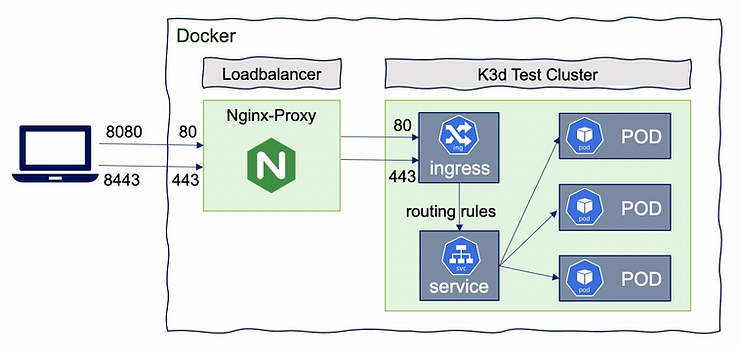

# K3D-Cluster

## TL;DR

Gere certificados de servidor na pasta certs para o servidor `fuf.me` usando mkcert, este domínio apontará para 127.0.0.1

```sh
$> chmod +x k3d-cluster
$> ./k3d-cluster
```

Isso instalará todo o software necessário se não estiver presente em seu sistema e o orientará na criação do cluster.

Software instalado se não existir:

* Docker
* k3d
* kubectl
* helm

O cluster será criado usando o k3d com os seguintes recursos:

* Cluster Kubernetes com **n** Server e **m** Agents
* Diretório do host montado como PersistentVolume (k3d-pv)
* Ingress Nginx com certificados personalizados [**opcional**]
* Painel do Kubernetes [**opcional**]
* Prometheus e Grafana [**opcional**]

Todas as senhas e informações necessárias serão exibidas no terminal.

***Enjoy Kubernetes!***

```sh
$> ./k3d-cluster 
Cluster Name [k3d-cluster]: 
Cluster Domain [fuf.me]: 
API Port [6443]: 
Servers (Masters) [1]: 
Agents (Workers) [1]: 2
LoadBalancer HTTP Port [80]: 
LoadBalancer HTTPS Port [443]: 


Deleting Previous Cluster
-------------------------------------
INFO[0000] No clusters found                            
-------------------------------------


Creating K3D cluster
-------------------------------------
INFO[0000] Using config file tmp-k3d-k3d-cluster.yaml   
INFO[0000] Prep: Network                                
INFO[0000] Created network 'k3d-k3d-cluster'            
INFO[0000] Created volume 'k3d-k3d-cluster-images'      
INFO[0001] Creating node 'k3d-k3d-cluster-server-0'     
INFO[0001] Creating node 'k3d-k3d-cluster-agent-0'      
INFO[0001] Creating node 'k3d-k3d-cluster-agent-1'      
INFO[0001] Creating LoadBalancer 'k3d-k3d-cluster-serverlb' 
INFO[0001] Starting cluster 'k3d-cluster'               
INFO[0001] Starting servers...                          
INFO[0001] Starting Node 'k3d-k3d-cluster-server-0'     
INFO[0007] Starting agents...                           
INFO[0007] Starting Node 'k3d-k3d-cluster-agent-0'      
INFO[0015] Starting Node 'k3d-k3d-cluster-agent-1'      
INFO[0023] Starting helpers...                          
INFO[0023] Starting Node 'k3d-k3d-cluster-serverlb'     
INFO[0025] (Optional) Trying to get IP of the docker host and inject it into the cluster as 'host.k3d.internal' for easy access 
INFO[0030] Successfully added host record to /etc/hosts in 4/4 nodes and to the CoreDNS ConfigMap 
INFO[0030] Cluster 'k3d-cluster' created successfully!  
INFO[0030] --kubeconfig-update-default=false --> sets --kubeconfig-switch-context=false 
INFO[0030] You can now use it like this:                
kubectl config use-context k3d-k3d-cluster
kubectl cluster-info
Switched to context "k3d-k3d-cluster".
Kubernetes control plane is running at https://0.0.0.0:6443
CoreDNS is running at https://0.0.0.0:6443/api/v1/namespaces/kube-system/services/kube-dns:dns/proxy
Metrics-server is running at https://0.0.0.0:6443/api/v1/namespaces/kube-system/services/https:metrics-server:/proxy

To further debug and diagnose cluster problems, use 'kubectl cluster-info dump'.
-------------------------------------


Provisioning Persistent Volume
-------------------------------------
persistentvolume/k3d-pv created
Name:            k3d-pv
Labels:          type=local
Annotations:     <none>
Finalizers:      [kubernetes.io/pv-protection]
StorageClass:    manual
Status:          Available
Claim:           
Reclaim Policy:  Retain
Access Modes:    RWO
VolumeMode:      Filesystem
Capacity:        50Gi
Node Affinity:   <none>
Message:         
Source:
    Type:          HostPath (bare host directory volume)
    Path:          /tmp/k3dvol
    HostPathType:  
Events:            <none>
-------------------------------------
Install Ingress? (Yes/No) [Yes]: 


Instaling Ingress
-------------------------------------
namespace/ingress created
secret/nginx-server-certs created
NAME: ingress
LAST DEPLOYED: Tue Mar  9 19:30:47 2021
NAMESPACE: ingress
STATUS: deployed
REVISION: 1
TEST SUITE: None
NOTES:
** Please be patient while the chart is being deployed **

The nginx-ingress controller has been installed.

Get the application URL by running these commands:

 NOTE: It may take a few minutes for the LoadBalancer IP to be available.
        You can watch its status by running 'kubectl get --namespace ingress svc -w ingress-nginx-ingress-controller'

    export SERVICE_IP=$(kubectl get svc --namespace ingress ingress-nginx-ingress-controller -o jsonpath='{.status.loadBalancer.ingress[0].ip}')
    echo "Visit http://${SERVICE_IP} to access your application via HTTP."
    echo "Visit https://${SERVICE_IP} to access your application via HTTPS."

An example Ingress that makes use of the controller:

  apiVersion: extensions/v1beta1
  kind: Ingress
  metadata:
    annotations:
      kubernetes.io/ingress.class: nginx
    name: example
    namespace: foo
  spec:
    rules:
      - host: www.example.com
        http:
          paths:
            - backend:
                serviceName: exampleService
                port: 80
              path: /
    # This section is only required if TLS is to be enabled for the Ingress
    tls:
        - hosts:
            - www.example.com
          secretName: example-tls

If TLS is enabled for the Ingress, a Secret containing the certificate and key must also be provided:

  apiVersion: v1
  kind: Secret
  metadata:
    name: example-tls
    namespace: foo
  data:
    tls.crt: <base64 encoded cert>
    tls.key: <base64 encoded key>
  type: kubernetes.io/tls
-------------------------------------


LoadBalancer info:
-------------------------------------
NAME                                               TYPE           CLUSTER-IP     EXTERNAL-IP   PORT(S)                      AGE
ingress-nginx-ingress-controller                   LoadBalancer   10.43.22.225   <pending>     80:31286/TCP,443:31747/TCP   5s
-------------------------------------
Install Dashbard? (Yes/No) [No]: 
Install Prometheus? (Yes/No) [No]:
```

## Instalar Software

### Instalar Docker

```sh
$ curl -L -o ./install-docker.sh "https://get.docker.com"
$ chmod +x ./install-docker.sh
$ ./install-docker.sh
$ sudo usermod -aG docker $USER
```

### Instalar K3D

Firs install k3d on your system with:

```sh
$ curl -s https://raw.githubusercontent.com/rancher/k3d/main/install.sh | bash
```

### Instalar kubectl

Also need install kubernetes client in order to manage cluster

```sh
$ curl -LO "https://storage.googleapis.com/kubernetes-release/release/$(curl -s https://storage.googleapis.com/kubernetes-release/release/stable.txt)/bin/linux/amd64/kubectl"
$ chmod +x ./kubectl
$ sudo mv ./kubectl /usr/local/bin/kubectl
$ kubectl version --client
```

### Instalar Helm

Due we will use helm for some deploymens is recomended you also install it.

```sh
$ curl -fsSL -o get_helm.sh https://raw.githubusercontent.com/helm/helm/master/scripts/get-helm-3
$ chmod +x ./get_helm.sh
$ ./get_helm.sh
```

### Instalar Lens

Esta ferramenta não é obrigatória, mas ajuda a inspecionar o cluster sem instalar o painel do kubernetes

basta acessar <https://k8slens.dev/> e fazer o download para o seu sistema

#### Instalação do Prometheus para métricas do Lens

Esta ferramenta faz uso do Prometheus se estiver disponível em cluster para sua metricas.

Você pode instalar o Prometheus usando **`k3d-cluster`**, por conta própria (veja abaixo) ou usando o Lens se você pular esta etapa antes.

Basta clicar com o botão direito do mouse no **ícone do cluster** à esquerda e escolher **Configurações** no menu pop-up. 
Isso levará à página de configurações.
Na página de configurações em **Recursos**, *Pilha de métricas*, clique no botão **Instalar**.
Isso iniciará a implantação do prometheus no cluster


## Implantar persistence kubernetes cluster

Crie um diretório em seu host onde o cluster Kubernetes ira persistir dados

`k3d-cluster` montará o diretório ./k3dvol para todos os nós do cluster no diretório `/tmp/k3dvol`.

Isso significa que todos os nós o compartilham como volume de persistência onde você pode armazenar seus dados persistentes.

Uma vez que o cluster é criado, você pode criar `PersitentVolume` apontando o volume montado com


```yaml
apiVersion: v1
kind: PersistentVolume
metadata:
  name: k3d-pv
  labels:
    type: local
spec:
  storageClassName: manual
  capacity:
    storage: 50Gi
  accessModes:
    - ReadWriteOnce
  hostPath:
    path: "/tmp/k3dvol"
```

```sh
$> kubectl apply -f ./examples/pv/k3d-pv.yaml
```

e usá-lo em **`PersitentVolumeClaim`**

### Criar Kubernetes Cluster com LoadBalancer

**NOTE**: **`Master`** and **`Workers`** nodes are renamed to **`Server`** and **`Agents`** resp.



Crie um cluster Kubernetes.

Para esta amostra manteremos o cluster simples, mas você pode definir "qualquer número" de Servers e Agentes, os limites são de bom senso e sua memória.

Observe que estamos apontando a porta 443 no host para a porta 443 do Cluster Load Balancer. 

Se você quiser usar http, você pode usar a porta 80. 

```sh
$ k3d cluster create dev-cluster \
--api-port 6443 \
--port 8443:443@loadbalancer  \
--port 8080:80@loadbalancer \
--volume $(pwd)/k3dvol:/tmp/k3dvol \
--servers 1 --agents 1
```

#### Mapeamento de portas

* `--port 8080:80@loadbalancer` adicionará um mapeamento da porta 8080 do host local para a porta 80 do balanceador de carga, que fará proxy de solicitações para a porta 80 em todos os nós do agente

* `--api-port 6443`: por padrão, nenhuma API-Port é exposta (sem mapeamento de porta do host). 
É usado para ter o API-Server do k3s escutando na porta 6553 com essa porta mapeada para o sistema host. 
Para que o balanceador de carga seja o ponto de acesso à API do Kubernetes, mesmo para clusters de vários servidores, você só precisa expor uma única porta de API. 
O balanceador de carga cuidará do proxy de suas solicitações para o nó do servidor apropriado

* `--port "32000-32767:32000-32767@loadbalancer"`
Você também pode expor um intervalo NodePort (se quiser evitar o Ingress Controller).

**Aviso**: mapear uma ampla variedade de portas pode levar algum tempo, e seu computador pode travar por algum tempo nesse processo.

#### Arquivo de configuração

K3D permite criar cluster usando arquivos de configuração

```sh
k3d cluster create --config cluster-configuration.yaml
```
where `cluster-configuration.yaml`

```yaml
apiVersion: k3d.io/v1alpha2
kind: Simple
name: test-cluster
servers: 3
agents: 2
kubeAPI:
  hostIP: "0.0.0.0"
  hostPort: "6446"
image: rancher/k3s:latest
volumes:
  - volume: /my/path:/some/path
    nodeFilters:
      - all
ports:
  - port: 80:80
    nodeFilters:
      - loadbalancer
  - port: 0.0.0.0:443:443
    nodeFilters:
      - loadbalancer
env:
  - envVar: bar=baz
    nodeFilters:
      - all
labels:
  - label: foo=bar
    nodeFilters:
      - server[0]
      - loadbalancer
registries:
  create: true
  use: []
  config: |
    mirrors:
      "my.company.registry":
        endpoint:
          - http://my.company.registry:5000

options:
  k3d:
    wait: true
    timeout: "360s" # should be pretty high for multi-server clusters to allow for a proper startup routine
    disableLoadbalancer: false
    disableImageVolume: false
  k3s:
    extraServerArgs:
      - --tls-san=127.0.0.1
#      - --no-deploy=traefik
#      - --flannel-backend=none      
    extraAgentArgs: []
  kubeconfig:
    updateDefaultKubeconfig: true
    switchCurrentContext: true
```

### Gerenciar clusters

Uma vez que o cluster é criado, podemos `iniciar`, `parar` ou até mesmo `apagá-los`

```sh
$ k3d cluster start <cluster-name>
$ k3d cluster stop <cluster-name>
$ k3d cluster delete <cluster-name>`
```


### Gerenciar nós de cluster


#### Listar nós do cluster

```sh
$ k3d node ls
NAME                       ROLE           CLUSTER       STATUS
k3d-k3d-cluster-agent-0    agent          k3d-cluster   running
k3d-k3d-cluster-agent-1    agent          k3d-cluster   running
k3d-k3d-cluster-server-0   server         k3d-cluster   running
k3d-k3d-cluster-serverlb   loadbalancer   k3d-cluster   running
```

#### Add/Delete nós do cluster

Crie novos nós (e adicione-os aos clusters existentes)

```sh
$ k3d node create <nodename$ --cluster <cluster-name$ --role <agent/server>
```

Para excluir nós, basta usar:

```sh
$ k3d node delete <nodename>
```

Examplo
```sh
$ k3d node ls
NAME                       ROLE           CLUSTER       STATUS
k3d-k3d-cluster-agent-0    agent          k3d-cluster   running
k3d-k3d-cluster-agent-1    agent          k3d-cluster   running
k3d-k3d-cluster-server-0   server         k3d-cluster   running
k3d-k3d-cluster-serverlb   loadbalancer   k3d-cluster   running

$ k3d node create my-new-agent-node --cluster k3d-cluster --role agent
INFO[0000] Starting Node 'k3d-my-new-agent-node-0'

$ k3d node ls
NAME                       ROLE           CLUSTER       STATUS
k3d-k3d-cluster-agent-0    agent          k3d-cluster   running
k3d-k3d-cluster-agent-1    agent          k3d-cluster   running
k3d-k3d-cluster-server-0   server         k3d-cluster   running
k3d-k3d-cluster-serverlb   loadbalancer   k3d-cluster   running
k3d-my-new-agent-node-0    agent          k3d-cluster   running

$ k3d node delete  k3d-my-new-agent-node-0
INFO[0000] Deleted k3d-my-new-agent-node-0   

$ k3d node ls
NAME                       ROLE           CLUSTER       STATUS
k3d-k3d-cluster-agent-0    agent          k3d-cluster   running
k3d-k3d-cluster-agent-1    agent          k3d-cluster   running
k3d-k3d-cluster-server-0   server         k3d-cluster   running
k3d-k3d-cluster-serverlb   loadbalancer   k3d-cluster   running

```


#### Start/Stop nodes

Também pode parar ou iniciar nós criados anteriormente com


```sh
$ k3d node start <nodename>
$ k3d node stop <nodename>
```

k3d create/start/stop/delete node mynode

### Gerencie seu registro

Criar ou excluir um registro interno local do kubernetes

```sh
$ k3d registry create REGISTRY_NAME 
$ k3d registry delete REGISTRY_NAME
```

### Substituir controlador de entrada

O K3D usa o Traefik 1.x versios como controlador do Ingress, devido ao Traefik 2.x ser bastante maduro e fornecer mais funcionalidades, precisamos fazer algum trabalho extra para usar o Traefik.

Primeiro, criamos um novo arquivo `helm-ingress-traefik.yaml`

```yaml
# see https://rancher.com/docs/k3s/latest/en/helm/
# see https://github.com/traefik/traefik-helm-chart
apiVersion: helm.cattle.io/v1
kind: HelmChart
metadata:
  name: ingress-controller-traefik
  namespace: kube-system
spec:
  repo: https://helm.traefik.io/traefik
  chart: traefik
  version: 9.8.0
  targetNamespace: kube-system
```


Agora podemos criar um novo cluster informando ao k3d para não implantar o traefik com
`--k3s-server-arg '--no-deploy=traefik'` e use o helm chart anterior definido para implantar o novo Traefik Ingress Controller
`--volume "$(pwd)/helm-ingress-traefik.yaml:/var/lib/rancher/k3s/server/manifests/helm-ingress-traefik.yaml"`


```sh
$ k3d cluster create traefik --k3s-server-arg '--no-deploy=traefik' --volume "$(pwd)/helm-ingress-traefik.yaml:/var/lib/rancher/k3s/server/manifests/helm-ingress-traefik.yaml"
```

### Entrada de instalação com certificados personalizados

Este script de instalação **`k3d-cluster`**, não instala o ingresso por padrão, mas fornece uma opção (ativada por padrão) para instalar o gráfico **`bitnami/ingress-nginx`** e definir os certificados de ingresso padrão.
Esses certificados são fornecidos na pasta **`certs`**.

Use **[mkcert](https://github.com/FiloSottile/mkcert)** para criar sua própria CA e gerar seus próprios certificados

Crie sua própria CA

```sh
$> mkcert -install
```

Crie um certificado assinado para seu cluster

```sh
$> cd certs
$> mkcert fuf.me "*.fuf.me" fuf.me
```

Criar um certificado assinado para vários domínios

```sh
$> mkcert fuf.me "*.fuf.me" fuf.me "*.vcap.me" vcap.me \
"*.localtest.me" localtest.me "*.yoogle.com" yoogle.com \
"*.lvh.me" lvh.me "*.bret.lol" bret.lol
```

Todos esses domínios apontam para 127.0.0.1

#### Usar vários domínios

Com mkcert você pode criar certificados para vários domínios curinga.

Você sempre pode adicionar novos certificados de domínio ao ingresso para substituir o cluster padrão

crie um novo certificado para seu cluster
```sh
$> mkcert 192.168.1.10.xip.io "*.192.168.1.10.xip.io" 192.168.1.10.xip.io
```

Crie um secret no namespace onde implantar a entrada para armazenar o certificado

```sh
$> $> kubectl create secret tls xip-server-certs --key 192.168.1.10.xip.io.key --cert 192.168.1.10.xip.io.pem
```

Use o certificado na implantação do Ingress

```yaml
apiVersion: networking.k8s.io/v1
kind: Ingress
metadata:
  name: nginx
  annotations:
    ingress.kubernetes.io/ssl-redirect: "true"
spec:
  tls:
    - hosts:
      - "nginx.192.168.1.10.xip.io.pem" 
    - secretName: xip-server-certs    
  rules:
    - host: "nginx.192.168.1.10.xip.io.pem"
      http:
        paths:
          - path: /
            pathType: Prefix
            backend:
              service:
                name: nginx
                port:
                  number: 80
```

### Using cert-manager

Use **[cert-manager](https://cert-manager.io/)** para gerenciar seus certificados de cluster de maneira mais eficiente e gerenciar diferentes emissores para gerar certificados.

## Implantar no Kubernetes

### Configurar KUBECOFIG

Por padrão, o k3d adiciona o cluster ao arquivo `~/.kube/config`.

Podemos escolher o cluster padrão com

```sh
$ kubectl config use-context k3d-<cluster-name>
```

ou configurando o ambiente KUBECONFIG

```sh
$ export KUBECONFIG=$(k3d kubeconfig write <cluster-name>)
```

#### Gerenciar Kubeconfig
O K3D fornece alguns comandos para gerenciar o kubeconfig

obter o kubeconfig do cluster dev

```sh
$ k3d kubeconfig get <cluster-name>
```

crie um arquivo kubeconfile em $HOME/.k3d/kubeconfig-dev.yaml
```sh
$ kubeconfig write <cluster-name>
```
obtenha o kubeconfig do(s) cluster(s) e mescle-o(s) em um arquivo em $HOME/.k3d ou outro arquivo

```sh
$ k3d kubeconfig merge ...
```

### Implantar o painel do Kubernetes

Implante o painel do kubernetes com

```sh
$ kubectl config use-context k3d-<cluster-name>
$ kubectl apply -f https://raw.githubusercontent.com/kubernetes/dashboard/v2.0.0/aio/deploy/recommended.yaml
```

Agora precisamos criar uma conta de painel e vincular essa conta a `cluster-admin-role`

```sh
$ kubectl create serviceaccount dashboard-admin-sa
$ kubectl kubectl create clusterrolebinding dashboard-admin-sa --clusterrole=cluster-admin --serviceaccount=default:dashboard-admin-sa
```

depois de criar este usuário, obtenha o token do usuário com

```sh
$ kubectl describe secret $(kubectl get secrets | grep ashboard-admin-sa | awk '{ print $1 }')
Name:         dashboard-admin-sa-token-bcf79
Namespace:    default
Labels:       <none>
Annotations:  kubernetes.io/service-account.name: dashboard-admin-sa
              kubernetes.io/service-account.uid: 96418a0c-60bd-4eab-aff9-4df4c6c46408

Type:  kubernetes.io/service-account-token

Data
====
ca.crt:     570 bytes
namespace:  7 bytes
token:      eyJhbGciOiJSUzI1NiIsImtpZCI6IjNDVFdKdVBZNndaVk5RWkh6dUxCcVRJVGo4RlQwUjFpWHg4emltTXlxRGsifQ.eyJpc3MiOiJrdWJlcm5ldGVzL3NlcnZpY2VhY2NvdW50Iiwia3ViZXJuZXRlcy5pby9zZXJ2aWNlYWNjb3VudC9uYW1lc3BhY2UiOiJkZWZhdWx0Iiwia3ViZXJuZXRlcy5pby9zZXJ2aWNlYWNjb3VudC9zZWNyZXQubmFtZSI6ImRhc2hib2FyZC1hZG1pbi1zYS10b2tlbi1iY2Y3OSIsImt1YmVybmV0ZXMuaW8vc2VydmljZWFjY291bnQvc2VydmljZS1hY2NvdW50Lm5hbWUiOiJkYXNoYm9hcmQtYWRtaW4tc2EiLCJrdWJlcm5ldGVzLmlvL3NlcnZpY2VhY2NvdW50L3NlcnZpY2UtYWNjb3VudC51aWQiOiI5NjQxOGEwYy02MGJkLTRlYWItYWZmOS00ZGY0YzZjNDY0MDgiLCJzdWIiOiJzeXN0ZW06c2VydmljZWFjY291bnQ6ZGVmYXVsdDpkYXNoYm9hcmQtYWRtaW4tc2EifQ.sfnBn4BWTpMK8_jd7EL-G2HvWSE7unW1lqsQ27DMT1D0WpuOQ-o1cEkrEqXFvXIYW8b7ciVcuNHhtQuWswmPbfQ6C8X_d1vbdpXoopVLPvkuHpFTbNMKtagBWJQlY1IepnCP_n4Q6neO82tjJ4uD_zC86RZ9-MebrVYNU5mjGtJ7XygH3c577wqBeIh1YgOvhY_K62QY3FJOHsX1_nTdKF4vphnzQjdIXhkpdCbzYuhvAmg1S7KOS6XFLOH9ytc_elY8k4T7w1UnmxmNPUIQo2fD4hQI-VqT42LruE5CXsrqPxml1aFz-FOID3049m7ZpQez70Ro3n73eHnKSLrDdA
```
Now execute 

```sh
$ kubectl proxy
Starting to serve on 127.0.0.1:8001
```
now open URL: 
<http://localhost:8001/api/v1/namespaces/kubernetes-dashboard/services/https:kubernetes-dashboard:/proxy/#/login$ 

and use Token to login


### Deploy Prometheus & Grafana

First deploy Prometheus & Grafana and create an ingress entry for Grafana, You can also create another ingress for Prometheus if you need

```sh
$ helm repo add prometheus-community https://prometheus-community.github.io/helm-charts
$ helm repo add stable https://charts.helm.sh/stable
$ helm repo update
$ helm install --namespace prometheus --create-namespace prometheus prometheus-community/prometheus
$ helm install --namespace prometheus --create-namespace grafana stable/grafana --set sidecar.datasources.enabled=true --set sidecar.dashboards.enabled=true --set sidecar.datasources.label=grafana_datasource --set sidecar.dashboards.label=grafana_dashboard
$ cat <<EOF | kubectl create -f -
apiVersion: networking.k8s.io/v1
kind: Ingress
metadata:
  name: nginx
  namespace: prometheus
  annotations:
    ingress.kubernetes.io/ssl-redirect: "false"
spec:
  rules:
    - host: grafana.fuf.me
      http:
        paths:
          - path: /
            pathType: Prefix
            backend:
              service:
                name: grafana
                port:
                  number: 80
EOF
```


Once all is installed we can retrieve Grafana credentials to login with `admin` user.

```sh
$ kubectl get secret --namespace prometheus grafana -o jsonpath="{.data.admin-password}" | base64 --decode ; echo
```

Now we can access Grafana and configure prometheus as  datasource for cluster metrics


Once installed Grafana you can importa lots of dashboards avaliable at:
<https://grafana.com/grafana/dashboards?>

A nice dashboards cluster could be:
<https://grafana.com/grafana/dashboards/11802>
<https://grafana.com/grafana/dashboards/1860>
<https://grafana.com/grafana/dashboards/5219>
<https://grafana.com/grafana/dashboards/7249>
<https://grafana.com/grafana/dashboards/13770>

### Deploy portainer

```sh
$ kubectl apply -f https://raw.githubusercontent.com/portainer/portainer-k8s/master/portainer.yaml
```
Once portainer is deployed you can access thought loadbalancer

```sh
$ kubectl -n portainer get svc
NAME        TYPE           CLUSTER-IP      EXTERNAL-IP    PORT(S)                         AGE
portainer   LoadBalancer   10.43.243.166   192.168.96.2   9000:31563/TCP,8000:30316/TCP   9m7s
```

### Deploy simple applications

```sh
$ kubectl config use-context k3d-k3d-cluster
$ kubectl create deployment nginx --image=nginx
$ kubectl create service clusterip nginx --tcp=80:80
$ kubectl apply -f  nginx-ingress.yml
```

```yml
# apiVersion: networking.k8s.io/v1beta1 # for k3s < v1.19
apiVersion: networking.k8s.io/v1
kind: Ingress
metadata:
  name: nginx
  annotations:
    ingress.kubernetes.io/ssl-redirect: "false"
spec:
  rules:
  - http:
      paths:
      - path: /
        pathType: Prefix
        backend:
          service:
            name: nginx
            port:
              number: 80
```

Testing deployments:

```sh
$ curl localhost
$ curl -k https://localhost          
$ kubectl get po --all-namespaces -o wide
NAMESPACE     NAME                                      READY   STATUS      RESTARTS   AGE    IP          NODE                       NOMINATED NODE   READINESS GATES
kube-system   metrics-server-86cbb8457f-5bpzr           1/1     Running     0          78m    10.42.0.3   k3d-dev-cluster-server-0   <none$           <none>
kube-system   local-path-provisioner-7c458769fb-hd2cc   1/1     Running     0          78m    10.42.1.3   k3d-dev-cluster-agent-0    <none$           <none>
kube-system   helm-install-traefik-4qh5z                0/1     Completed   0          78m    10.42.0.2   k3d-dev-cluster-server-0   <none$           <none>
kube-system   coredns-854c77959c-jmp94                  1/1     Running     0          78m    10.42.1.2   k3d-dev-cluster-agent-0    <none$           <none>
kube-system   svclb-traefik-6ch8f                       2/2     Running     0          78m    10.42.0.4   k3d-dev-cluster-server-0   <none$           <none>
kube-system   svclb-traefik-9tmk4                       2/2     Running     0          78m    10.42.1.4   k3d-dev-cluster-agent-0    <none$           <none>
kube-system   svclb-traefik-h8vgj                       2/2     Running     0          78m    10.42.2.3   k3d-dev-cluster-agent-1    <none$           <none>
kube-system   traefik-6f9cbd9bd4-6bjp4                  1/1     Running     0          78m    10.42.2.2   k3d-dev-cluster-agent-1    <none$           <none>
default       nginx-6799fc88d8-vcjp5                    1/1     Running     0          29m    10.42.2.4   k3d-dev-cluster-agent-1    <none$           <none>
$ kubectl scale deployment nginx --replicas 4
$ kubectl get po --all-namespaces -o wide
```

### Deploy Persistence Application  

`persistence-app.yml`

```yml
apiVersion: v1
kind: PersistentVolume
metadata:
  name: task-pv-volume
  labels:
    type: local
spec:
  storageClassName: manual
  capacity:
    storage: 1Gi
  accessModes:
    - ReadWriteOnce
  hostPath:
    path: "/tmp/k3dvol"
---
apiVersion: v1
kind: PersistentVolumeClaim
metadata:
  name: task-pv-claim
spec:
  storageClassName: manual
  accessModes:
    - ReadWriteOnce
  resources:
    requests:
      storage: 1Gi
---
apiVersion: apps/v1
kind: Deployment
metadata:
  name: echo
spec:
  selector:
    matchLabels:
      app: echo
  strategy:
    type: Recreate
  template:
    metadata:
      labels:
        app: echo
    spec:
      volumes:
        - name: task-pv-storage
          persistentVolumeClaim:
            claimName: task-pv-claim
      containers:
      - image: busybox
        name: echo
        volumeMounts:
          - mountPath: "/data"
            name: task-pv-storage
        command: ["ping", "127.0.0.1"]
```

```sh
$ kubectl apply -f persistence-app.yml
$ kubectl get pv
NAME             CAPACITY   ACCESS MODES   RECLAIM POLICY   STATUS   CLAIM                   STORAGECLASS   REASON   AGE
task-pv-volume   1Gi        RWO            Retain           Bound    default/task-pv-claim   manual                  2m54s
$ kubectl get pvc
NAME             STATUS   VOLUME                                     CAPACITY   ACCESS MODES   STORAGECLASS   AGE
task-pv-claim    Bound    task-pv-volume                             1Gi        RWO            manual         11s
$ kubectl get pods
NAME                   READY   STATUS    RESTARTS   AGE
echo-58fd7d9b6-x4rxj   1/1     Running   0          16s
```


References
<https://github.com/rancher/k3d$ 
<https://k3s.io/$ <https://github.com/k3s-io/k3s$ 
<https://en.sokube.ch/post/k3s-k3d-k8s-a-new-perfect-match-for-dev-and-test$ 
<https://dev.to/sosan/k3s-y-k3d-buena-combinacion-para-el-desarrollo-en-local-y-tests-locales-a48$ 
https://sysdig.com/blog/kubernetes-monitoring-prometheus-operator-part3/
<https://sysdig.com/blog/kubernetes-monitoring-prometheus/$ 
<https://sysdig.com/blog/kubernetes-monitoring-with-prometheus-alertmanager-grafana-pushgateway-part-2/>
<https://sysdig.com/blog/kubernetes-monitoring-prometheus-operator-part3/>