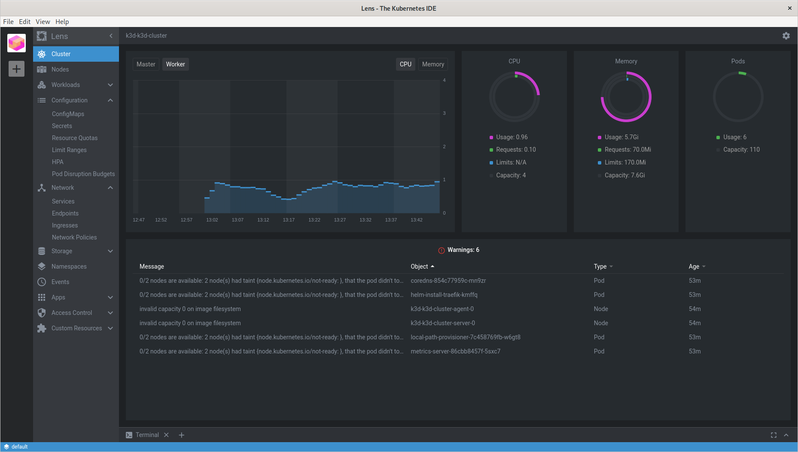
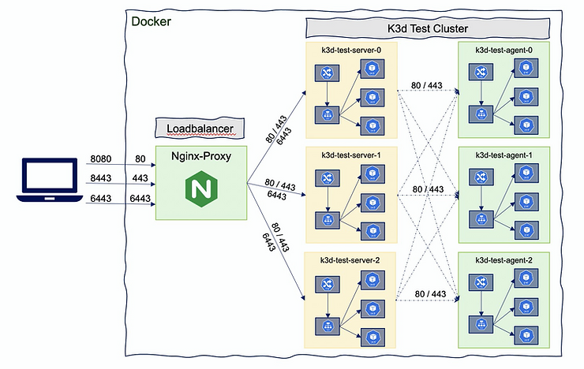
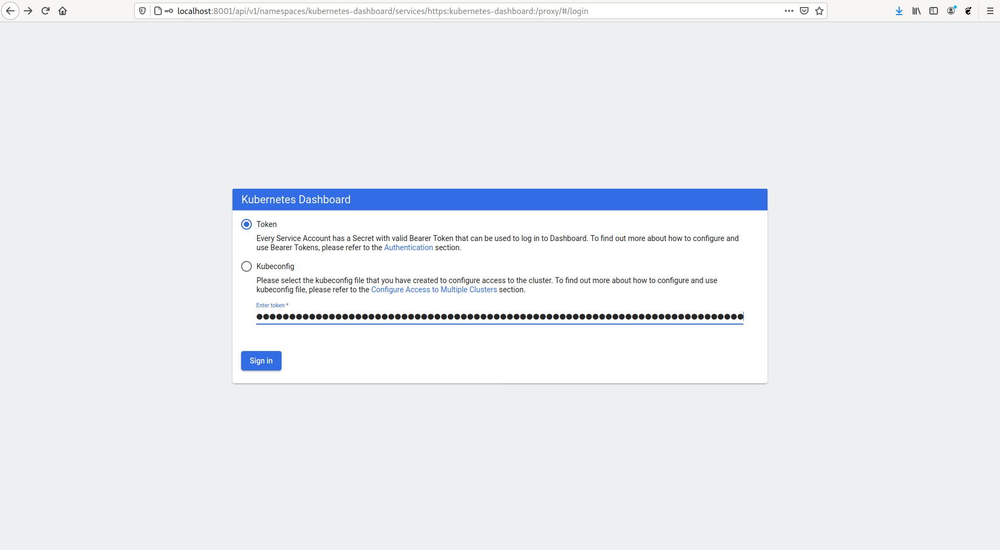
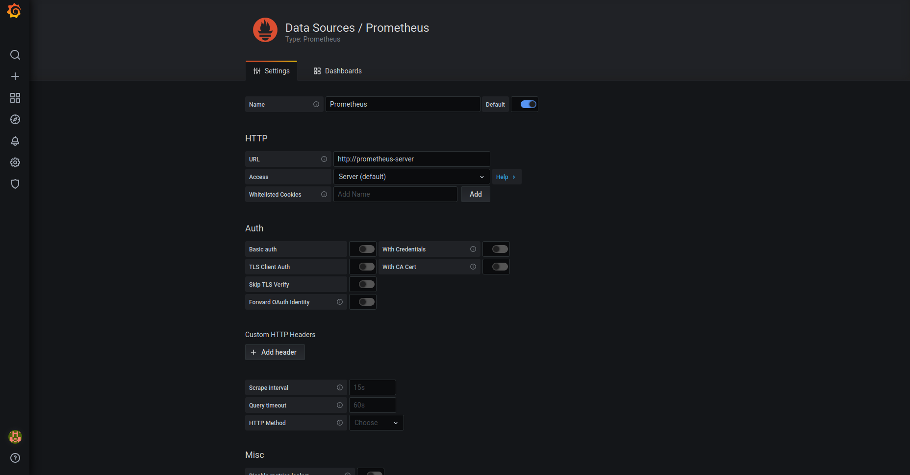

# K3D-Cluster

## TL;DR

Gere certificados de servidor na pasta certs para o servidor `fuf.me` usando mkcert, este domínio apontará para 127.0.0.1

```sh
$> chmod +x k3d-cluster
$> ./k3d-cluster
```

Isso instalará todo o software necessário se não estiver presente em seu sistema e o orientará na criação do cluster.

Software instalado se não existir:

* Docker
* k3d
* kubectl
* helm

O cluster será criado usando o k3d com os seguintes recursos:

* Cluster Kubernetes com **n** Server e **m** Agents
* Diretório do host montado como PersistentVolume 
* Cert-Manager
* Ingress Nginx com certificados personalizados
* Rancher v2.6.x [**opcional**]
* Jenkins [**opcional**]
* SonarQube [**opcional**]
* Harhor [**opcional**]
* NeuVector [**opcional** **É necessaria editar o arquivo "neuvector-values.yaml" e adicionar o DOMINIO**] 
* Prometheus e Grafana [**opcional**]

Todas as senhas e informações necessárias serão exibidas no terminal.

***Enjoy Kubernetes!***

```sh
$> ./k3d-cluster 
Nome Cluster [k3d-rancher]:
Cluster Domain [devops.com]:
Porta API [6443]:
Servers (Masters) [1]:
Agents (Workers) [1]: 2


Deletando Previous Cluster
-------------------------------------
INFO[0000] Deleting cluster 'k3d-rancher'
INFO[0009] Deleting cluster network 'k3d-k3d-rancher'
INFO[0009] Deleting 2 attached volumes...
WARN[0009] Failed to delete volume 'k3d-k3d-rancher-images' of cluster 'k3d-rancher': failed to find volume 'k3d-k3d-rancher-images': Error: No such volume: k3d-k3d-rancher-images -> Try to delete it manually
INFO[0009] Removing cluster details from default kubeconfig...
INFO[0009] Removing standalone kubeconfig file (if there is one)...
INFO[0009] Successfully deleted cluster k3d-rancher!
-------------------------------------


Criando K3D cluster
-------------------------------------
INFO[0000] Using config file tmp-k3d-k3d-rancher.yaml (k3d.io/v1alpha2#simple)
WARN[0000] Default config apiVersion is 'k3d.io/v1alpha4', but you're using 'k3d.io/v1alpha2': consider migrating.
INFO[0000] portmapping '0.0.0.0:80:80' targets the loadbalancer: defaulting to [servers:*:proxy agents:*:proxy]
INFO[0000] portmapping '0.0.0.0:443:443' targets the loadbalancer: defaulting to [servers:*:proxy agents:*:proxy]
INFO[0000] portmapping '0.0.0.0:8900:30080' targets the loadbalancer: defaulting to [servers:*:proxy agents:*:proxy]
INFO[0000] portmapping '0.0.0.0:8901:30081' targets the loadbalancer: defaulting to [servers:*:proxy agents:*:proxy]
INFO[0000] portmapping '0.0.0.0:8902:30082' targets the loadbalancer: defaulting to [servers:*:proxy agents:*:proxy]
INFO[0000] Prep: Network
INFO[0000] Created network 'k3d-k3d-rancher'
INFO[0000] Created image volume k3d-k3d-rancher-images
INFO[0000] Starting new tools node...
INFO[0000] Starting Node 'k3d-k3d-rancher-tools'
INFO[0001] Creating node 'k3d-k3d-rancher-server-0'
INFO[0001] Creating node 'k3d-k3d-rancher-agent-0'
INFO[0001] Creating node 'k3d-k3d-rancher-agent-1'
INFO[0001] Creating LoadBalancer 'k3d-k3d-rancher-serverlb'
INFO[0001] Using the k3d-tools node to gather environment information
INFO[0002] HostIP: using network gateway 192.168.80.1 address
INFO[0002] Starting cluster 'k3d-rancher'
INFO[0002] Starting servers...
INFO[0002] Starting Node 'k3d-k3d-rancher-server-0'
INFO[0009] Starting agents...
INFO[0012] Starting Node 'k3d-k3d-rancher-agent-0'
INFO[0013] Starting Node 'k3d-k3d-rancher-agent-1'
INFO[0021] Starting helpers...
INFO[0021] Starting Node 'k3d-k3d-rancher-serverlb'
INFO[0028] Injecting records for hostAliases (incl. host.k3d.internal) and for 4 network members into CoreDNS configmap...
INFO[0031] Cluster 'k3d-rancher' created successfully!
INFO[0031] You can now use it like this:
kubectl cluster-info


waiting for cluster init ...
-------------------------------------
Switched to context "k3d-k3d-rancher".
Kubernetes control plane is running at https://0.0.0.0:6443
CoreDNS is running at https://0.0.0.0:6443/api/v1/namespaces/kube-system/services/kube-dns:dns/proxy
Metrics-server is running at https://0.0.0.0:6443/api/v1/namespaces/kube-system/services/https:metrics-server:https/proxy

To further debug and diagnose cluster problems, use 'kubectl cluster-info dump'.
-------------------------------------


Provisioning Persistent Volume
-------------------------------------
persistentvolume/k3d-pv created
-------------------------------------
Install Ingress? (Yes/No) [Yes]:


Instaling Ingress
-------------------------------------
Atingido:1 https://download.docker.com/linux/ubuntu jammy InRelease
Atingido:2 http://br.archive.ubuntu.com/ubuntu jammy InRelease
Atingido:3 http://security.ubuntu.com/ubuntu jammy-security InRelease
Atingido:4 http://br.archive.ubuntu.com/ubuntu jammy-updates InRelease
Atingido:5 http://br.archive.ubuntu.com/ubuntu jammy-backports InRelease
Lendo listas de pacotes... Pronto
Lendo listas de pacotes... Pronto
Construindo árvore de dependências... Pronto
Lendo informação de estado... Pronto
wget já é a versão mais recente (1.21.2-2ubuntu1).
libnss3-tools já é a versão mais recente (2:3.68.2-0ubuntu1).
0 pacotes atualizados, 0 pacotes novos instalados, 0 a serem removidos e 0 não atualizados.
  % Total    % Received % Xferd  Average Speed   Time    Time     Time  Current
                                 Dload  Upload   Total   Spent    Left  Speed
100   123  100   123    0     0    262      0 --:--:-- --:--:-- --:--:--   262
  0     0    0     0    0     0      0      0 --:--:--  0:00:01 --:--:--     0
Warning: Failed to create the file mkcert-v1.4.4-linux-amd64: Arquivo existe
  0     0    0     0    0     0      0      0 --:--:--  0:00:01 --:--:--     0
curl: (23) Failed writing header
The local CA is already installed in the system trust store! 👍
ERROR: no Firefox and/or Chrome/Chromium security databases found

/home/efcunha/.local/share/mkcert
Note: the local CA is not installed in the Firefox and/or Chrome/Chromium trust store.
Run "mkcert -install" for certificates to be trusted automatically ⚠️

Created a new certificate valid for the following names 📜
 - "devops.com"
 - "localhost"
 - "127.0.0.1"
 - "192.168.1.10"
 - "::1"

The certificate is at "./devops.com+4.pem" and the key at "./devops.com+4-key.pem" ✅

It will expire on 25 September 2024 🗓

namespace/ingress created
secret/nginx-server-certs created
NAME: ingress
LAST DEPLOYED: Sat Jun 25 16:22:11 2022
NAMESPACE: ingress
STATUS: deployed
REVISION: 1
TEST SUITE: None
NOTES:
CHART NAME: nginx-ingress-controller
CHART VERSION: 9.2.13
APP VERSION: 1.2.1

** Please be patient while the chart is being deployed **

The nginx-ingress controller has been installed.

Get the application URL by running these commands:

 NOTE: It may take a few minutes for the LoadBalancer IP to be available.
        You can watch its status by running 'kubectl get --namespace ingress svc -w ingress-nginx-ingress-controller'

    export SERVICE_IP=$(kubectl get svc --namespace ingress ingress-nginx-ingress-controller -o jsonpath='{.status.loadBalancer.ingress[0].ip}')
    echo "Visit http://${SERVICE_IP} to access your application via HTTP."
    echo "Visit https://${SERVICE_IP} to access your application via HTTPS."

An example Ingress that makes use of the controller:

  apiVersion: networking.k8s.io/v1
  kind: Ingress
  metadata:
    name: example
    namespace: ingress
  spec:
    ingressClassName: nginx
    rules:
      - host: www.example.com
        http:
          paths:
            - backend:
                service:
                  name: example-service
                  port:
                    number: 80
              path: /
              pathType: Prefix
    # This section is only required if TLS is to be enabled for the Ingress
    tls:
        - hosts:
            - www.example.com
          secretName: example-tls

If TLS is enabled for the Ingress, a Secret containing the certificate and key must also be provided:

  apiVersion: v1
  kind: Secret
  metadata:
    name: example-tls
    namespace: ingress
  data:
    tls.crt: <base64 encoded cert>
    tls.key: <base64 encoded key>
  type: kubernetes.io/tls
-------------------------------------


LoadBalancer info:
-------------------------------------
NAME                                               TYPE           CLUSTER-IP     EXTERNAL-IP   PORT(S)                      AGE
ingress-nginx-ingress-controller                   LoadBalancer   10.43.47.253   <pending>     80:32068/TCP,443:32384/TCP   5s
acesso ao Nginx https://127.0.0.1 ou https://nginx.xxxx.com
-------------------------------------
Install Rancher? (Yes/No) [Yes]:
customresourcedefinition.apiextensions.k8s.io/certificaterequests.cert-manager.io created
customresourcedefinition.apiextensions.k8s.io/certificates.cert-manager.io created
customresourcedefinition.apiextensions.k8s.io/challenges.acme.cert-manager.io created
customresourcedefinition.apiextensions.k8s.io/clusterissuers.cert-manager.io created
customresourcedefinition.apiextensions.k8s.io/issuers.cert-manager.io created
customresourcedefinition.apiextensions.k8s.io/orders.acme.cert-manager.io created
namespace/cert-manager created
NAME: cert-manager
LAST DEPLOYED: Sat Jun 25 16:26:35 2022
NAMESPACE: cert-manager
STATUS: deployed
REVISION: 1
TEST SUITE: None
NOTES:
cert-manager v1.8.2 has been deployed successfully!

In order to begin issuing certificates, you will need to set up a ClusterIssuer
or Issuer resource (for example, by creating a 'letsencrypt-staging' issuer).

More information on the different types of issuers and how to configure them
can be found in our documentation:

https://cert-manager.io/docs/configuration/

For information on how to configure cert-manager to automatically provision
Certificates for Ingress resources, take a look at the `ingress-shim`
documentation:

https://cert-manager.io/docs/usage/ingress/
namespace/cattle-system created
secret/tls-rancher-ingress created
NAME: rancher
LAST DEPLOYED: Sat Jun 25 16:27:27 2022
NAMESPACE: cattle-system
STATUS: deployed
REVISION: 1
TEST SUITE: None
NOTES:
Rancher Server has been installed.

NOTE: Rancher may take several minutes to fully initialize. Please standby while Certificates are being issued, Containers are started and the Ingress rule comes up.

Check out our docs at https://rancher.com/docs/

If you provided your own bootstrap password during installation, browse to https://rancher.devops.com to get started.

If this is the first time you installed Rancher, get started by running this command and clicking the URL it generates:

echo https://rancher.devops.com/dashboard/?setup=$(kubectl get secret --namespace cattle-system bootstrap-secret -o go-template='{{.data.bootstrapPassword|base64decode}}')

To get just the bootstrap password on its own, run:

kubectl get secret --namespace cattle-system bootstrap-secret -o go-template='{{.data.bootstrapPassword|base64decode}}{{ "\n" }}'

Happy Containering!

service/ranchernp created

-------------------------------------
Waiting for deployment "rancher" rollout to finish: 0 of 1 updated replicas are available...
Waiting for deployment spec update to be observed...
Waiting for deployment "rancher" rollout to finish: 0 of 1 updated replicas are available...
deployment "rancher" successfully rolled out
NAME      READY   UP-TO-DATE   AVAILABLE   AGE
rancher   1/1     1            1           96s
acesso ao Rancher https://127.0.0.1:8901 ou https://rancher.xxxx.com:8901
-------------------------------------

Install Dashbard? (Yes/No) [No]:
Install Prometheus? (Yes/No) [No]:
```
## Instalar Software
### Instalar Docker

```sh
$ curl -L -o ./install-docker.sh "https://get.docker.com"
$ chmod +x ./install-docker.sh
$ ./install-docker.sh
$ sudo usermod -aG docker $USER
```

### Instalar K3D

Firs install k3d on your system with:

```sh
$ curl -s https://raw.githubusercontent.com/rancher/k3d/main/install.sh | bash
```

### Instalar kubectl

Also need install kubernetes client in order to manage cluster

```sh
$ curl -LO "https://storage.googleapis.com/kubernetes-release/release/$(curl -s https://storage.googleapis.com/kubernetes-release/release/stable.txt)/bin/linux/amd64/kubectl"
$ chmod +x ./kubectl
$ sudo mv ./kubectl /usr/local/bin/kubectl
$ kubectl version --client
```

### Instalar Helm

Due we will use helm for some deploymens is recomended you also install it.

```sh
$ curl -fsSL -o get_helm.sh https://raw.githubusercontent.com/helm/helm/master/scripts/get-helm-3
$ chmod +x ./get_helm.sh
$ ./get_helm.sh
```

### Instalar Lens

Esta ferramenta não é obrigatória, mas ajuda a inspecionar o cluster sem instalar o painel do kubernetes

basta acessar <https://k8slens.dev/> e fazer o download para o seu sistema

#### Instalação do Prometheus para métricas do Lens

Esta ferramenta faz uso do Prometheus se estiver disponível em cluster para sua metricas.

Você pode instalar o Prometheus usando **`k3d-cluster`**, por conta própria (veja abaixo) ou usando o Lens se você pular esta etapa antes.

Basta clicar com o botão direito do mouse no **ícone do cluster** à esquerda e escolher **Configurações** no menu pop-up. 
Isso levará à página de configurações.
Na página de configurações em **Recursos**, *Pilha de métricas*, clique no botão **Instalar**.
Isso iniciará a implantação do prometheus no cluster



### Gerenciar clusters

Uma vez que o cluster é criado, podemos `iniciar`, `parar` ou até mesmo `apagá-los`

```sh
$ k3d cluster start <cluster-name>
$ k3d cluster stop <cluster-name>
$ k3d cluster delete <cluster-name>`
```

### Gerenciar nós de cluster



#### Listar nós do cluster

```sh
$ k3d node ls
NAME                       ROLE           CLUSTER       STATUS
k3d-k3d-cluster-agent-0    agent          k3d-cluster   running
k3d-k3d-cluster-agent-1    agent          k3d-cluster   running
k3d-k3d-cluster-server-0   server         k3d-cluster   running
k3d-k3d-cluster-serverlb   loadbalancer   k3d-cluster   running
```

#### Add/Delete nós do cluster

Crie novos nós (e adicione-os aos clusters existentes)

```sh
$ k3d node create <nodename$ --cluster <cluster-name$ --role <agent/server>
```

Para excluir nós, basta usar:

```sh
$ k3d node delete <nodename>
```

Examplo
```sh
$ k3d node ls
NAME                       ROLE           CLUSTER       STATUS
k3d-k3d-cluster-agent-0    agent          k3d-cluster   running
k3d-k3d-cluster-agent-1    agent          k3d-cluster   running
k3d-k3d-cluster-server-0   server         k3d-cluster   running
k3d-k3d-cluster-serverlb   loadbalancer   k3d-cluster   running

$ k3d node create my-new-agent-node --cluster k3d-cluster --role agent
INFO[0000] Starting Node 'k3d-my-new-agent-node-0'

$ k3d node ls
NAME                       ROLE           CLUSTER       STATUS
k3d-k3d-cluster-agent-0    agent          k3d-cluster   running
k3d-k3d-cluster-agent-1    agent          k3d-cluster   running
k3d-k3d-cluster-server-0   server         k3d-cluster   running
k3d-k3d-cluster-serverlb   loadbalancer   k3d-cluster   running
k3d-my-new-agent-node-0    agent          k3d-cluster   running

$ k3d node delete  k3d-my-new-agent-node-0
INFO[0000] Deleted k3d-my-new-agent-node-0   

$ k3d node ls
NAME                       ROLE           CLUSTER       STATUS
k3d-k3d-cluster-agent-0    agent          k3d-cluster   running
k3d-k3d-cluster-agent-1    agent          k3d-cluster   running
k3d-k3d-cluster-server-0   server         k3d-cluster   running
k3d-k3d-cluster-serverlb   loadbalancer   k3d-cluster   running

```
#### Start/Stop nodes

Também pode parar ou iniciar nós criados anteriormente com

```sh
$ k3d node start <nodename>
$ k3d node stop <nodename>
```
k3d create/start/stop/delete node mynode
### Gerencie seu registro

Criar ou excluir um registro interno local do kubernetes

```sh
$ k3d registry create REGISTRY_NAME 
$ k3d registry delete REGISTRY_NAME
```

### Entrada de instalação com certificados personalizados

Este script de instalação **`k3d-cluster`**, não instala o ingresso por padrão, mas fornece uma opção (ativada por padrão) para instalar o gráfico **`bitnami/ingress-nginx`** e definir os certificados de ingresso padrão.
Esses certificados são fornecidos na pasta **`certs`**.

Use **[mkcert](https://github.com/FiloSottile/mkcert)** para criar sua própria CA e gerar seus próprios certificados

Crie sua própria CA

```sh
$> mkcert -install
```

Crie um certificado assinado para seu cluster

```sh
$> cd certs
$> mkcert fuf.me "*.fuf.me" fuf.me
```

Criar um certificado assinado para vários domínios

```sh
$> mkcert fuf.me "*.fuf.me" fuf.me "*.vcap.me" vcap.me \
"*.localtest.me" localtest.me "*.yoogle.com" yoogle.com \
"*.lvh.me" lvh.me "*.bret.lol" bret.lol
```

Todos esses domínios apontam para 127.0.0.1
#### Usar vários domínios

Com mkcert você pode criar certificados para vários domínios curinga.

Você sempre pode adicionar novos certificados de domínio ao ingresso para substituir o cluster padrão

crie um novo certificado para seu cluster
```sh
$> mkcert 192.168.1.10.xip.io "*.192.168.1.10.xip.io" 192.168.1.10.xip.io
```

Crie um secret no namespace onde implantar a entrada para armazenar o certificado

```sh
$> $> kubectl create secret tls xip-server-certs --key 192.168.1.10.xip.io.key --cert 192.168.1.10.xip.io.pem
```

Use o certificado na implantação do Ingress

```yaml
apiVersion: networking.k8s.io/v1
kind: Ingress
metadata:
  name: nginx
  annotations:
    ingress.kubernetes.io/ssl-redirect: "true"
spec:
  tls:
    - hosts:
      - "nginx.192.168.1.10.xip.io.pem" 
    - secretName: xip-server-certs    
  rules:
    - host: "nginx.192.168.1.10.xip.io.pem"
      http:
        paths:
          - path: /
            pathType: Prefix
            backend:
              service:
                name: nginx
                port:
                  number: 80
```

### Using cert-manager

Use **[cert-manager](https://cert-manager.io/)** para gerenciar seus certificados de cluster de maneira mais eficiente e gerenciar diferentes emissores para gerar certificados.

## Implantar no Kubernetes

### Configurar KUBECOFIG

Por padrão, o k3d adiciona o cluster ao arquivo `~/.kube/config`.

Podemos escolher o cluster padrão com

```sh
$ kubectl config use-context k3d-<cluster-name>
```

ou configurando o ambiente KUBECONFIG

```sh
$ export KUBECONFIG=$(k3d kubeconfig write <cluster-name>)
```

#### Gerenciar Kubeconfig
O K3D fornece alguns comandos para gerenciar o kubeconfig

obter o kubeconfig do cluster dev

```sh
$ k3d kubeconfig get <cluster-name>
```

crie um arquivo kubeconfile em $HOME/.k3d/kubeconfig-dev.yaml
```sh
$ kubeconfig write <cluster-name>
```
obtenha o kubeconfig do(s) cluster(s) e mescle-o(s) em um arquivo em $HOME/.k3d ou outro arquivo

```sh
$ k3d kubeconfig merge ...
```

### Implantar o painel do Kubernetes

Implante o painel do kubernetes com

```sh
$ kubectl config use-context k3d-<cluster-name>
$ kubectl apply -f https://raw.githubusercontent.com/kubernetes/dashboard/v2.0.0/aio/deploy/recommended.yaml
```

Agora precisamos criar uma conta de painel e vincular essa conta a `cluster-admin-role`

```sh
$ kubectl create serviceaccount dashboard-admin-sa
$ kubectl kubectl create clusterrolebinding dashboard-admin-sa --clusterrole=cluster-admin --serviceaccount=default:dashboard-admin-sa
```

depois de criar este usuário, obtenha o token do usuário com

```sh
$ kubectl describe secret $(kubectl get secrets | grep ashboard-admin-sa | awk '{ print $1 }')
Name:         dashboard-admin-sa-token-bcf79
Namespace:    default
Labels:       <none>
Annotations:  kubernetes.io/service-account.name: dashboard-admin-sa
              kubernetes.io/service-account.uid: 96418a0c-60bd-4eab-aff9-4df4c6c46408

Type:  kubernetes.io/service-account-token

Data
====
ca.crt:     570 bytes
namespace:  7 bytes
token:      eyJhbGciOiJSUzI1NiIsImtpZCI6IjNDVFdKdVBZNndaVk5RWkh6dUxCcVRJVGo4RlQwUjFpWHg4emltTXlxRGsifQ.eyJpc3MiOiJrdWJlcm5ldGVzL3NlcnZpY2VhY2NvdW50Iiwia3ViZXJuZXRlcy5pby9zZXJ2aWNlYWNjb3VudC9uYW1lc3BhY2UiOiJkZWZhdWx0Iiwia3ViZXJuZXRlcy5pby9zZXJ2aWNlYWNjb3VudC9zZWNyZXQubmFtZSI6ImRhc2hib2FyZC1hZG1pbi1zYS10b2tlbi1iY2Y3OSIsImt1YmVybmV0ZXMuaW8vc2VydmljZWFjY291bnQvc2VydmljZS1hY2NvdW50Lm5hbWUiOiJkYXNoYm9hcmQtYWRtaW4tc2EiLCJrdWJlcm5ldGVzLmlvL3NlcnZpY2VhY2NvdW50L3NlcnZpY2UtYWNjb3VudC51aWQiOiI5NjQxOGEwYy02MGJkLTRlYWItYWZmOS00ZGY0YzZjNDY0MDgiLCJzdWIiOiJzeXN0ZW06c2VydmljZWFjY291bnQ6ZGVmYXVsdDpkYXNoYm9hcmQtYWRtaW4tc2EifQ.sfnBn4BWTpMK8_jd7EL-G2HvWSE7unW1lqsQ27DMT1D0WpuOQ-o1cEkrEqXFvXIYW8b7ciVcuNHhtQuWswmPbfQ6C8X_d1vbdpXoopVLPvkuHpFTbNMKtagBWJQlY1IepnCP_n4Q6neO82tjJ4uD_zC86RZ9-MebrVYNU5mjGtJ7XygH3c577wqBeIh1YgOvhY_K62QY3FJOHsX1_nTdKF4vphnzQjdIXhkpdCbzYuhvAmg1S7KOS6XFLOH9ytc_elY8k4T7w1UnmxmNPUIQo2fD4hQI-VqT42LruE5CXsrqPxml1aFz-FOID3049m7ZpQez70Ro3n73eHnKSLrDdA
```
Now execute 

```sh
$ kubectl proxy
Starting to serve on 127.0.0.1:8001
```
now open URL: 
<http://localhost:8001/api/v1/namespaces/kubernetes-dashboard/services/https:kubernetes-dashboard:/proxy/#/login$ 

and use Token to login




### Deploy Prometheus & Grafana

First deploy Prometheus & Grafana and create an ingress entry for Grafana, You can also create another ingress for Prometheus if you need

```sh
$ helm repo add prometheus-community https://prometheus-community.github.io/helm-charts
$ helm repo add stable https://charts.helm.sh/stable
$ helm repo update
$ helm install --namespace prometheus --create-namespace prometheus prometheus-community/prometheus
$ helm install --namespace prometheus --create-namespace grafana stable/grafana --set sidecar.datasources.enabled=true --set sidecar.dashboards.enabled=true --set sidecar.datasources.label=grafana_datasource --set sidecar.dashboards.label=grafana_dashboard
$ cat <<EOF | kubectl create -f -
apiVersion: networking.k8s.io/v1
kind: Ingress
metadata:
  name: nginx
  namespace: prometheus
  annotations:
    ingress.kubernetes.io/ssl-redirect: "false"
spec:
  rules:
    - host: grafana.fuf.me
      http:
        paths:
          - path: /
            pathType: Prefix
            backend:
              service:
                name: grafana
                port:
                  number: 80
EOF
```


Uma vez que tudo esteja instalado, podemos recuperar as credenciais do Grafana para fazer login com o usuário `admin`.

```sh
$ kubectl get secret --namespace prometheus grafana -o jsonpath="{.data.admin-password}" | base64 --decode ; echo
```

Agora podemos acessar o Grafana e configurar o prometheus como fonte de dados para métricas de cluster



Uma vez instalado o Grafana, você pode importar muitos painéis disponíveis em:

<https://grafana.com/grafana/dashboards?>

Um bom cluster de painéis poderia ser:
<https://grafana.com/grafana/dashboards/11802>
<https://grafana.com/grafana/dashboards/1860>
<https://grafana.com/grafana/dashboards/5219>
<https://grafana.com/grafana/dashboards/7249>
<https://grafana.com/grafana/dashboards/13770>

### Deploy simple applications

```sh
$ kubectl config use-context k3d-k3d-cluster
$ kubectl create deployment nginx --image=nginx
$ kubectl create service clusterip nginx --tcp=80:80
$ kubectl apply -f  nginx-ingress.yml
```

```yml
# apiVersion: networking.k8s.io/v1beta1 # for k3s < v1.19
apiVersion: networking.k8s.io/v1
kind: Ingress
metadata:
  name: nginx
  annotations:
    ingress.kubernetes.io/ssl-redirect: "false"
spec:
  rules:
  - http:
      paths:
      - path: /
        pathType: Prefix
        backend:
          service:
            name: nginx
            port:
              number: 80
```

Testando implantações:

```sh
$ curl localhost

$ curl -k https://localhost          

$ kubectl cluster-info && kubectl get nodes && kubectl get pods --all-namespaces

Kubernetes control plane is running at https://0.0.0.0:6443
CoreDNS is running at https://0.0.0.0:6443/api/v1/namespaces/kube-system/services/kube-dns:dns/proxy
Metrics-server is running at https://0.0.0.0:6443/api/v1/namespaces/kube-system/services/https:metrics-server:https/proxy

To further debug and diagnose cluster problems, use 'kubectl cluster-info dump'.

NAME                       STATUS   ROLES                  AGE   VERSION
k3d-k3d-rancher-agent-0    Ready    <none>                 15m   v1.21.13+k3s1
k3d-k3d-rancher-agent-1    Ready    <none>                 15m   v1.21.13+k3s1
k3d-k3d-rancher-server-0   Ready    control-plane,master   15m   v1.21.13+k3s1

NAMESPACE                   NAME                                                              READY   STATUS      RESTARTS   AGE
kube-system                 local-path-provisioner-84bb864455-nf86p                           1/1     Running     0          15m
kube-system                 metrics-server-ff9dbcb6c-d6d9n                                    1/1     Running     0          15m
kube-system                 coredns-574bcc6c46-tgchp                                          1/1     Running     0          15m
ingress                     svclb-ingress-nginx-ingress-controller-pbt5z                      2/2     Running     0          9m26s
ingress                     svclb-ingress-nginx-ingress-controller-jg7rm                      2/2     Running     0          9m26s
ingress                     svclb-ingress-nginx-ingress-controller-9x6f8                      2/2     Running     0          9m26s
ingress                     ingress-nginx-ingress-controller-default-backend-6dcc7fb4ckqn4b   1/1     Running     0          9m26s
ingress                     ingress-nginx-ingress-controller-6c675cf787-kh2t8                 1/1     Running     0          9m26s
cert-manager                cert-manager-5bb7949947-2dxn7                                     1/1     Running     0          5m1s
cert-manager                cert-manager-cainjector-5ff98c66d-w9phm                           1/1     Running     0          5m1s
cert-manager                cert-manager-webhook-fb48856b5-lnbbj                              1/1     Running     0          5m1s
cattle-system               rancher-865f7d9454-8flbw                                          1/1     Running     0          4m10s
cattle-system               helm-operation-fcczj                                              0/2     Completed   0          2m27s
cattle-fleet-system         gitjob-cc9948fd7-mwtgg                                            1/1     Running     0          100s
cattle-fleet-system         fleet-controller-5746685958-x6g7d                                 1/1     Running     0          100s
cattle-system               helm-operation-t9tm2                                              0/2     Completed   0          2m1s
cattle-system               rancher-webhook-6958cfcddf-f9488                                  1/1     Running     0          84s
cattle-system               helm-operation-ql9jt                                              0/2     Completed   0          87s
cattle-fleet-local-system   fleet-agent-57497ff7dc-f59hk                                      1/1     Running     0          70s

$ kubectl scale deployment nginx --replicas 4

$ kubectl get po --all-namespaces -o wide
```

### Deploy Persistence Application  

`persistence-app.yml`

```yml
apiVersion: v1
kind: PersistentVolume
metadata:
  name: task-pv-volume
  labels:
    type: local
spec:
  storageClassName: manual
  capacity:
    storage: 1Gi
  accessModes:
    - ReadWriteOnce
  hostPath:
    path: "/tmp/k3dvol"
---
apiVersion: v1
kind: PersistentVolumeClaim
metadata:
  name: task-pv-claim
spec:
  storageClassName: manual
  accessModes:
    - ReadWriteOnce
  resources:
    requests:
      storage: 1Gi
---
apiVersion: apps/v1
kind: Deployment
metadata:
  name: echo
spec:
  selector:
    matchLabels:
      app: echo
  strategy:
    type: Recreate
  template:
    metadata:
      labels:
        app: echo
    spec:
      volumes:
        - name: task-pv-storage
          persistentVolumeClaim:
            claimName: task-pv-claim
      containers:
      - image: busybox
        name: echo
        volumeMounts:
          - mountPath: "/data"
            name: task-pv-storage
        command: ["ping", "127.0.0.1"]
```

```sh
$ kubectl apply -f persistence-app.yml
$ kubectl get pv
NAME             CAPACITY   ACCESS MODES   RECLAIM POLICY   STATUS   CLAIM                   STORAGECLASS   REASON   AGE
task-pv-volume   1Gi        RWO            Retain           Bound    default/task-pv-claim   manual                  2m54s
$ kubectl get pvc
NAME             STATUS   VOLUME                                     CAPACITY   ACCESS MODES   STORAGECLASS   AGE
task-pv-claim    Bound    task-pv-volume                             1Gi        RWO            manual         11s
$ kubectl get pods
NAME                   READY   STATUS    RESTARTS   AGE
echo-58fd7d9b6-x4rxj   1/1     Running   0          16s
```

# References
<https://github.com/rancher/k3d$ 
<https://k3s.io/$ <https://github.com/k3s-io/k3s$ 
<https://en.sokube.ch/post/k3s-k3d-k8s-a-new-perfect-match-for-dev-and-test$ 
<https://dev.to/sosan/k3s-y-k3d-buena-combinacion-para-el-desarrollo-en-local-y-tests-locales-a48$ 
https://sysdig.com/blog/kubernetes-monitoring-prometheus-operator-part3/
<https://sysdig.com/blog/kubernetes-monitoring-prometheus/$ 
<https://sysdig.com/blog/kubernetes-monitoring-with-prometheus-alertmanager-grafana-pushgateway-part-2/>
<https://sysdig.com/blog/kubernetes-monitoring-prometheus-operator-part3/>